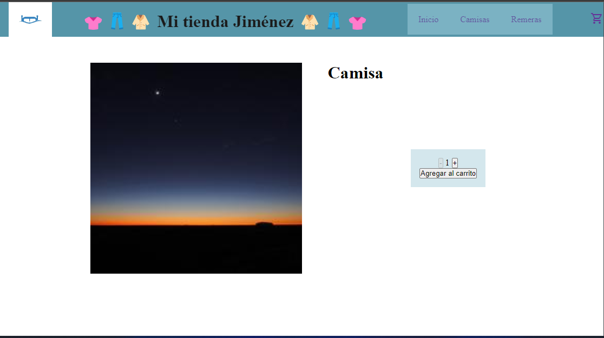
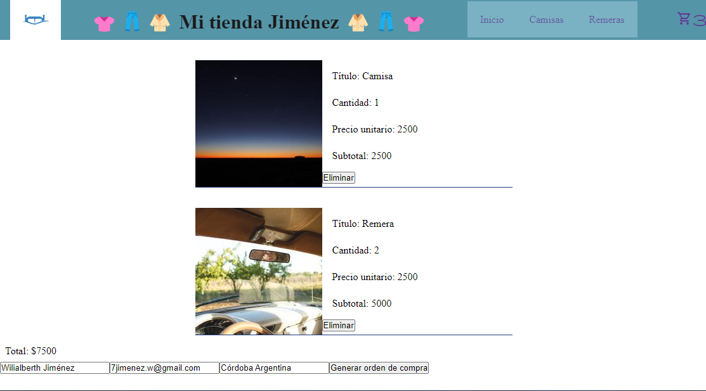
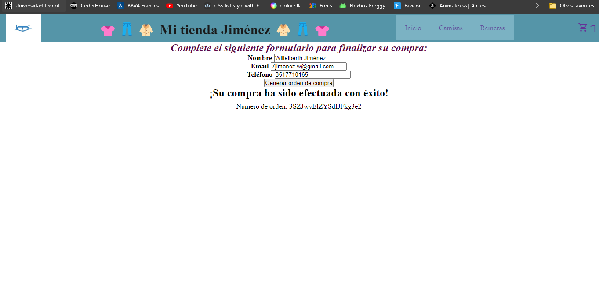

# Mi primer proyecto react
## Entrega final CoderHouse
Proyecto realizado con la finalidad de obtener mi certificado de React Js y así sumarlo con Desarrollo Web y JS.


`Alcance del proyecto:`
1. Navbar realizado con links a través de un Componente NavBar y CartWidget con el icono del carrito de compras usando herramientas de Google.
2. Uso de Props.
3. Estilos con CCS3 y material.
4. Opción de aumentar y/o disminuir la cantidad de productos a adquirir limitado por la cantidad de stock existente.
5. Cards en estilo vertical con imagen, descripción del producto, stock y botón para ver mayor información. Todo llamado con un map y promise manual.
6. Una vez cargada la información breve de cada producto se procede a cargar la información detallada la cual es obtenida mediante una promise que ejecuta un find para buscar el producto oir su id.
7. El cliente tiene la opción de seguir comprando, agregar o eliminar producto del carrito, ver la suma total de los productos agregados y finalmente realizar la compra.

`Utilicé:`
* Librerías de react.
* Librerías de react router dom.
* Firebase/Firestore.
* Google fonts.
* Material icons.
* Props.
* UseState.
* useEffect.
* JS.
* CCS

Adjunto algunas imagenes de mi proyecto:








`Sobre mí`
* Venezolano, recibido de cardiopulmonar de la facultad de medicina de la UCV.
* Estudiante actualmente de ingeniería química en la UTN - Córdoba, Argentina.
* Estudiante de programación Fullstack.

Agradezco al profesor por su paciencia y esa facilidad que tiene para explicar y hacerse entender.
Agradezco al tutor que, conjuntamente con el de DW fueron los mejores que he tenido.

Espero verlos pronto nuevamente y ojalá sea codeando juntos.

A recordar:
```No hay pregunta tonta sino tonto el que pregunta.```